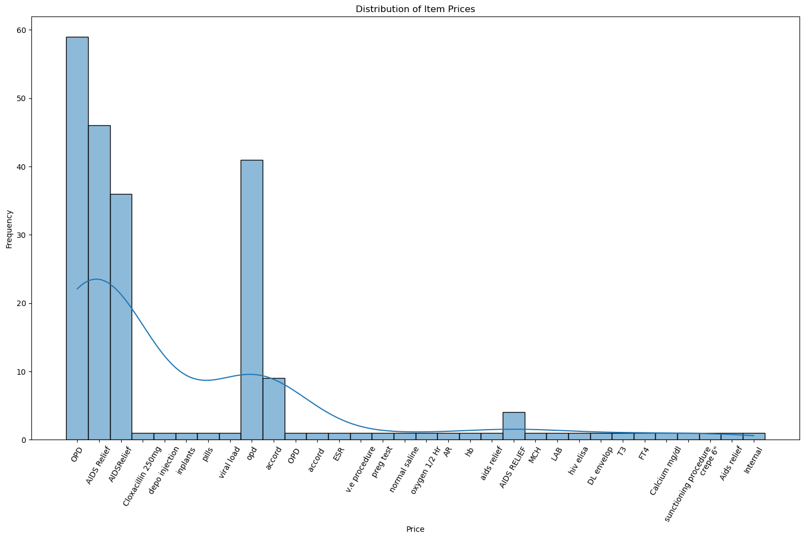
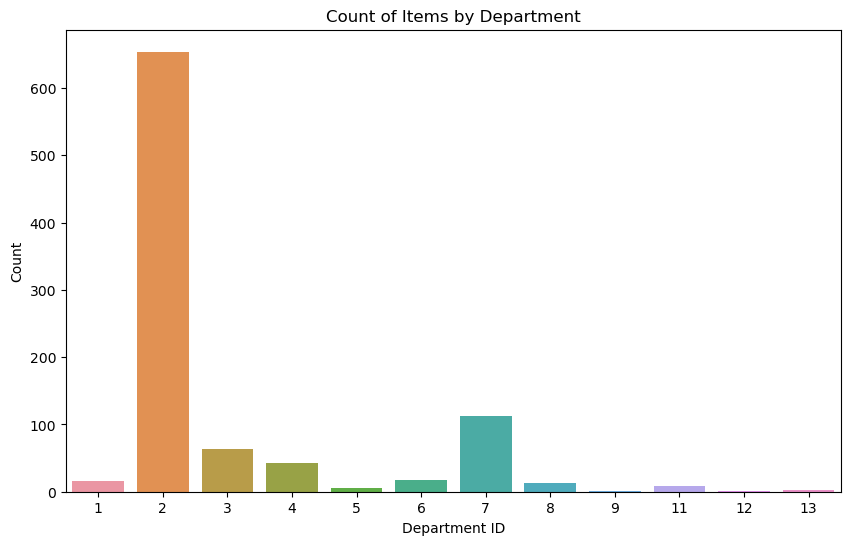
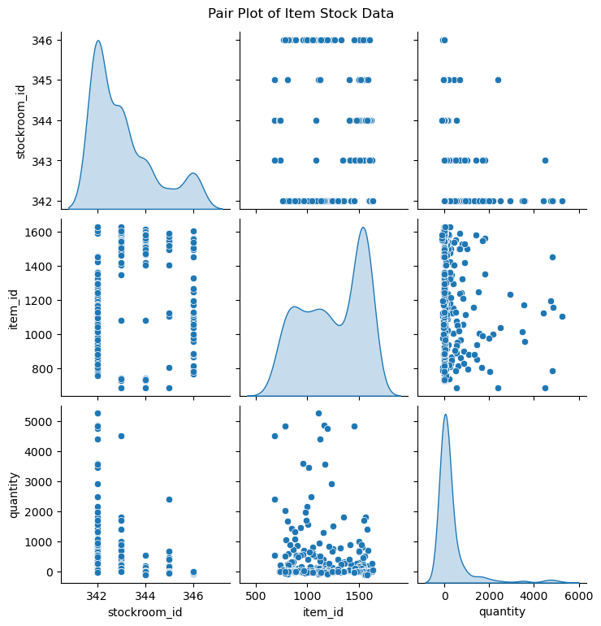
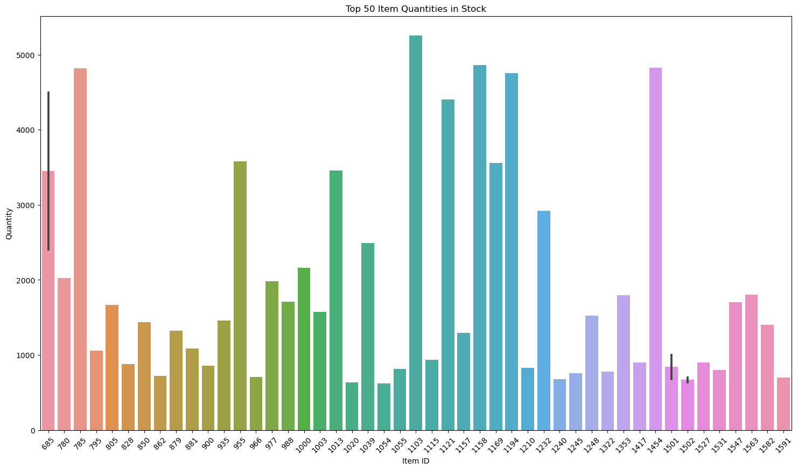

# Healthcare_Inventory_Optimization_and_Marketing_Strategies
### Important Project Files:
1. **DataAnalysis.ipynb** (Analysis Jupyter document)
2. **Inventory.sqlite3** (Database)
3. **SourceData** (inv_item.txt, inv_item_price.txt, inv_item_stock.txt, inv_stockroom.txt)
4. **Inventory Analysis Report** (PDF)

### Business Problem
The marketing team at a healthcare platform needs actionable insights from inventory data to refine their promotional strategies. By understanding inventory dynamics, they can better target their promotions, ensuring that items in stock are highlighted and those running low are restocked promptly.

### Business Objective
To leverage inventory data analysis to enhance the effectiveness of marketing strategies, ensuring optimal stock levels and targeted promotions that drive sales and improve customer satisfaction.

### Overview
In this scenario, I was provided with a dataset containing detailed information about the inventory on a healthcare platform. My task was to analyze this dataset and extract insights that would help the marketing team improve their promotional strategies. The analysis focused on the following key points:

- **Average Price Analysis**:
  - Calculate the average price of items with physical inventory.
  - Calculate the average price of items without physical inventory.

- **Storeroom Inventory Analysis**:
  - Identify which storeroom has the most inventory.

- **Price Modification Timing**:
  - Determine the time in minutes since item prices were last modified.

- **Stock Status**:
  - List items that are running out of stock.
  - List items whose quantity is zero and how long (in minutes) they have been in this state.

By addressing these points, the marketing team can gain valuable insights into inventory trends and make informed decisions to optimize their promotional strategies. This will help ensure that high-demand items are adequately stocked and promoted, while also identifying opportunities to clear out items that are not moving.
### Visualizations
Here are some key visualizations to support our analysis:

*Figure 1: Distribution of Item Prices*
The plot visually highlights the top 50 items with the highest quantities in stock, making it easy to identify which items are most abundant.

*Figure 2: Number of Items per Department*
Price Distribution: The histogram visually represents the distribution of item prices, showing how frequently different price ranges occur.The height of the bars indicates how many items fall within each price range, with that the KDE line provides a smoothed view of the distribution, helping to identify trends and patterns in the data, such as peaks and valleys.

*Figure 3: Pair Plot*
 The count plot visually represents the distribution of items across different departments, showing how many items belong to each department

*Figure 4: Top Items*
Each cell in the matrix represents a scatter plot of two variables from the inv_item_stock DataFrame.The scatter plots show the relationship between pairs of variables, allowing for visual inspection of correlation.From this there are strong linear relationships between certain pairs of variables, indicating high correlation and Some variables have skewed distributions, as shown by the KDE plots on the diagonal.Finally a few outliers are present in the scatter plots, which may need further investigation.

In Conclusion,to optimize sales and enhance inventory management, the marketing team should implement a multifaceted strategy. Firstly, promotional efforts should be concentrated on the top 10 high-demand items. By highlighting these products in marketing campaigns, the team can maximize sales and ensure that popular items are readily available to meet customer demand.

In parallel, it is essential to address low-demand items. Offering discounts or clearance sales for the top 10 low-demand items can help clear out inventory that is not moving as quickly. This approach not only frees up valuable storage space but also provides an opportunity to attract price-sensitive customers and increase overall sales volume.

Effective stock management is another critical component. The stockroom with the most inventory should be meticulously managed to ensure it is well-stocked with high-demand items. This proactive approach helps prevent stockouts, ensuring that customers can always find the products they are looking for, thereby enhancing customer satisfaction and loyalty.

Lastly, a thorough analysis of the impact of pricing on sales is crucial. By understanding how different price points affect sales volume, the marketing team can make informed decisions to adjust prices strategically. This data-driven approach allows for the optimization of pricing strategies to maximize revenue, ensuring that the healthcare platform remains competitive and profitable.

By integrating these strategies, the marketing team can create a balanced approach that not only drives sales but also maintains efficient inventory levels, ultimately contributing to the overall success of the healthcare platform.

